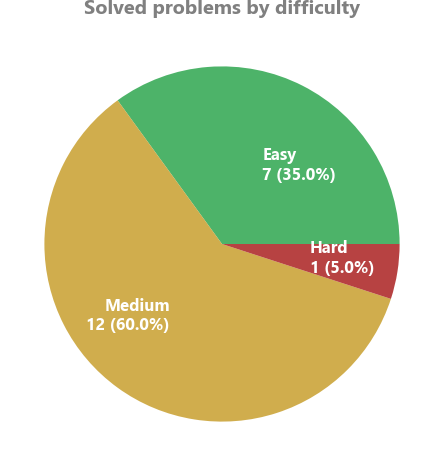
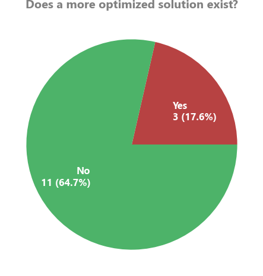
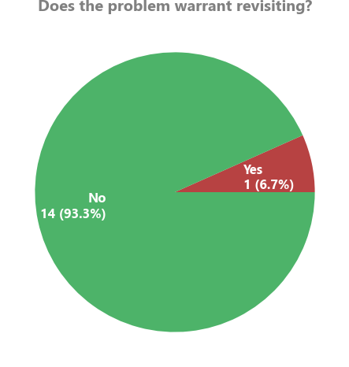

# Leetcode solutions
This is a repository of my solutions to the Leetcode problems in order.

## Bookmarked
*A list of problems to revisit and why:*
 - Problem 10: Completed with native Python regex, but did not solve without native regex as was likely the intent of the problem
 - Problem 15: Unable to figure out fully optimized ThreeSum algorithm