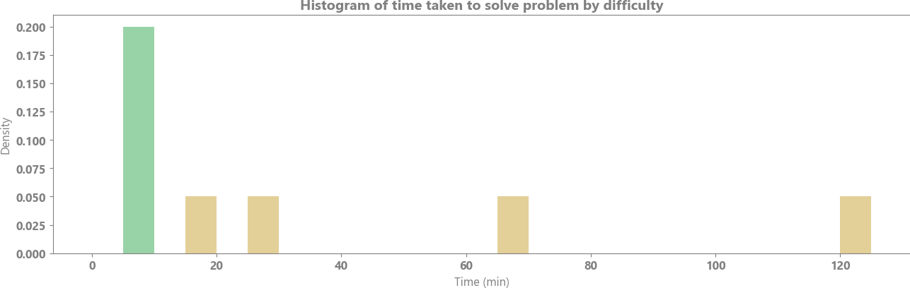

# Leetcode solutions

This is a repository of my solutions to the [Leetcode](https://leetcode.com/problems/) problems in order.

## Performance analysis
 

## Bookmarked
A list of problems to revisit and why:
 - Problem 10: Completed with native Python regex, but did not solve without native regex as was likely the intent of the problem
 - Problem 15: Unable to figure out fully optimized ThreeSum algorithm