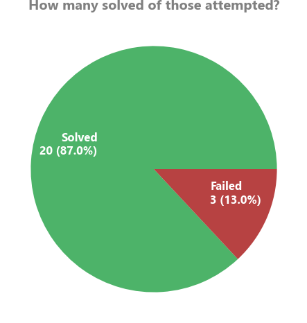
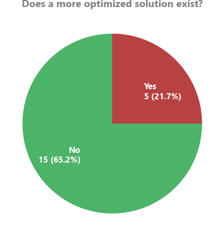
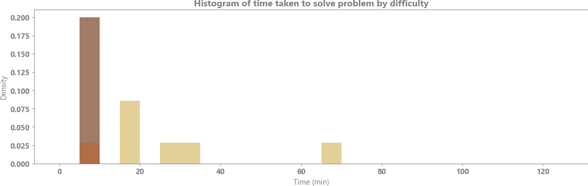

# Leetcode solutions

This is a repository of my solutions to the [Leetcode](https://leetcode.com/problems/) problems in order.

## Performance analysis
 

## Bookmarked
A list of solved problems to revisit and why:
 - Problem 15: Unable to figure out fully optimized ThreeSum algorithm